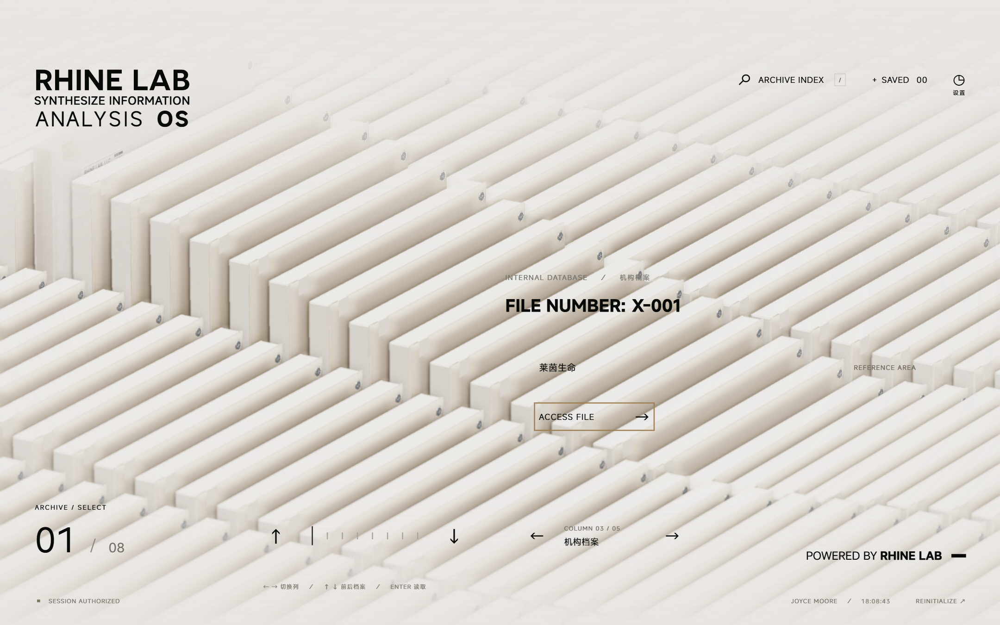

# RHINE LAB · 本地知识库与三维档案终端

Rhine Lab 是基于《明日方舟》莱茵生命终端视觉制作的非官方交互项目。当前同时保留网页版和 **Windows 本地 Markdown 知识库客户端**。

客户端当前版本为 **1.1.1**。首页复用网页版的完整三维阵列、灯光、镜头、开场、详情和模型查看器；知识库通过独立窗口打开。文档保存在程序旁的本地文件夹中，打包后无需安装 Node.js、启动开发服务器或登录账户即可离线使用。

[用户教程](#用户使用教程) · [项目路径](#项目路径) · [技术栈](#项目技术栈) · [开发与构建](#开发与构建) · [AI 开发指引](#面向-ai-的下一步开发指引)



## 项目路径

以下为本机路径，移动项目或换电脑后需要调整。

| 用途 | 路径 |
| --- | --- |
| 主项目与交付源码 | `E:\CodexSandbox\Projects\RhineLabUI-main` |
| 本文件 | `E:\CodexSandbox\Projects\RhineLabUI-main\README.md` |
| 本机环境说明 | `E:\CodexSandbox\AGENT.md` |
| 项目开发约束 | `E:\CodexSandbox\Projects\RhineLabUI-main\AGENTS.md` |
| 原始桌面改造计划 | `E:\CodexSandbox\Projects\RhineLabUI-main\plan.md` |
| 客户端程序 | `E:\CodexSandbox\Projects\RhineLabUI-main\release\packages\RhineLab-win32-x64\RhineLab.exe` |
| 1.1.1 便携压缩包 | `E:\CodexSandbox\Projects\RhineLabUI-main\release\packages\make\zip\win32\x64\RhineLab-win32-x64-1.1.1.zip` |
| 压缩包校验清单 | `E:\CodexSandbox\Projects\RhineLabUI-main\release\packages\make\SHA256SUMS.txt` |
| 当前交付程序的知识库 | `E:\CodexSandbox\Projects\RhineLabUI-main\release\packages\RhineLab-win32-x64\RhineLabData`，首次启动创建 |
| 网页开发地址 | `http://127.0.0.1:5173/`，需要开发服务正在运行 |
| 网页生产构建 | `E:\CodexSandbox\Projects\RhineLabUI-main\dist` |
| 桌面页面构建 | `E:\CodexSandbox\Projects\RhineLabUI-main\release\desktop\site` |
| 前次开发与验证工作副本 | `C:\Users\Administrator\Documents\ChatGPT\CodexSandbox\RhineLabUI-desktop` |

**以 E 盘主项目为交付位置。** C 盘工作副本用于前次构建和验证，并非自动同步目录；继续开发前必须比较两边文件，不能直接用旧副本覆盖主项目。

在线网页版入口：[rhine.lubeiluchen.cc](https://rhine.lubeiluchen.cc/)。Wallpaper Engine 版本另行维护于 [RhineLabWallpaper](https://github.com/LBEILC/RhineLabWallpaper)，不等同于本地知识库客户端。

## 用户使用教程

### 1. 启动客户端

1. 本机直接打开上述 `RhineLab.exe`。在其他位置使用时，将便携 ZIP **完整解压**到自己有写入权限的目录，再运行其中的 `RhineLab.exe`。
2. 保留程序旁的 `resources` 等运行文件，不能只复制一个 EXE。
3. 等待资源载入，点击“点击进入”，进入开场。可以通过 `ENTER SYSTEM` 跳过开场。
4. 首次初始化时自动导入 40 份示例档案。之后即使删空知识库，也不会再次自动导入。

程序不依赖 `127.0.0.1:5173`。该地址只用于网页开发与视觉对照，关闭开发服务器不影响打包客户端。

### 2. 浏览三维档案

| 操作 | 效果 |
| --- | --- |
| `←` / `→` 或底部左右按钮 | 切换阵列列位置 |
| `↑` / `↓` 或档案导航按钮 | 浏览当前列的档案 |
| 拖动阵列 | 平面浏览，松手后按速度继续滑动并吸附 |
| 在阵列上滚动鼠标滚轮 | 切换档案 |
| `ACCESS FILE` 或文件编号 | 读取选中档案 |
| 详情页 `EDIT` | 打开该文档的本地编辑窗口 |
| `SAVE ARCHIVE` | 收藏当前档案 |
| `SAVED` | 打开知识库的收藏列表 |
| `Esc` | 返回或关闭当前窗口；编辑窗口会先处理未保存内容 |
| `REINITIALIZE` | 重播开场 |

阵列有 **40 个逻辑展陈槽位**，背景会循环显示；完整知识库的文档数量不受 40 篇限制。打开展陈范围之外的文档后，它会被映射到展陈槽位。空槽位会显示新建提示。按真实分类查找文档，请使用知识库窗口的分类筛选。

详情页的“360° 查看文档模型”提供拖动旋转、滚轮缩放、方向键平移、玻璃清晰/磨砂切换、拆解和一键重组。关闭查看器返回档案。

### 3. 新建、编辑与保存

1. 点击顶部 **ARCHIVE INDEX**，或在阵列界面按 `/`，打开本地知识库。
2. 点击左上角“＋ 新建”，填写文档标题和分类。
3. 在源码区输入 Markdown；选择“源码”“分栏”或“阅读”切换显示方式。
4. 点击“保存”或按 `Ctrl+S`，确认底部状态显示已保存。
5. 点击 `CLOSE` 返回三维界面。切换文档或关闭编辑窗口时，有未保存修改会提示保存、放弃或取消。

编辑器支持标题、列表、引用、代码块、链接与表格。例如：

```markdown
# 项目笔记

## 今天的记录

- 完成第一份本地文档
- 整理研究资料

> 需要继续验证的想法。

| 事项 | 状态 |
| --- | --- |
| 文档整理 | 进行中 |
```

预览禁用原始 HTML 和脚本。HTTP/HTTPS 外链通过系统浏览器打开。当前版本尚不支持图片附件管理，不会自动载入 Markdown 中的图片。

编辑窗口内可使用 `Ctrl+N` 新建、`Ctrl+F` 聚焦全文搜索；在源码区用 `Ctrl+B` / `Ctrl+I` 添加粗体或斜体标记。常用格式也可通过工具栏插入。

### 4. 搜索、分类和排序

- 搜索框匹配标题、分类和正文，适用于完整知识库。
- 分类下拉框只显示选定分类的文档。
- “全部”“收藏”“回收区”分别切换列表范围。
- 排序可选择手动顺序、标题或最近修改。
- 手动顺序模式下拖动列表中的文档调整位置，顺序写入 Markdown 元数据，重启后保留。

### 5. 删除与恢复

选中文档后点击“移入回收区”，确认后进入回收区。误删时切到“回收区”，选择文档并点击“恢复”。回收区中的文档为只读；“永久删除”需再次确认，不能通过回收区恢复。

### 6. 找到本地文件、备份和迁移

在知识库窗口点击“打开知识库文件夹”，可以查看程序旁的 `RhineLabData`：

```text
RhineLab-win32-x64/
├─ RhineLab.exe
├─ resources/
└─ RhineLabData/
   ├─ documents/       # 正常文档，每篇一个 .md 文件
   ├─ .trash/          # 回收区
   └─ backups/         # 写入前的历史备份
```

文档使用 UTF-8 Markdown。文件头保存稳定 ID、标题、分类、排序和时间，正文保留原始 Markdown。修改标题不会修改稳定 ID 文件名。文档内容不依赖浏览器缓存；收藏和界面偏好单独保存。

可以使用其他 Markdown 工具编辑这些文件。客户端会监听外部变化，也可点击“刷新”。若磁盘版本与未保存内容冲突，界面会提供另存副本或放弃并重新载入的选择。

**备份或搬迁：** 先关闭程序，复制整个程序目录及其中的 `RhineLabData`。仅备份文档时至少保留完整 `RhineLabData`；它不包含全部界面偏好，偏好和收藏可在设置中另行导出 JSON。

**更新程序：** 先退出客户端并备份 `RhineLabData`，再用新版本替换程序文件，保留原有 `RhineLabData`。不要删除整个旧目录后再解压。当前没有自动更新功能。

遇到目录不可写的提示时，将整个程序目录移到可写位置；应用不会静默将文档改存到其他位置。不要将知识库目录改成符号链接或目录联接。

### 7. 显示、声音与偏好迁移

顶部“设置”提供亮暗配色、音效和音乐音量、画质、完整/减少/自定义动画以及全屏。运行不够流畅时可启用“超级性能模式”，它与减少动画分别控制。客户端支持 `F11` 切换全屏，`Esc` 退出全屏。

设置中可以导出和导入偏好与收藏 JSON，文件上限为 1 MB。导入会替换当前偏好与收藏；文件不包含 Markdown 正文。网页与客户端的示例编号相同，因此示例收藏可以迁移。

### 网页版与客户端的区别

| 项目 | Windows 客户端 | 网页版 |
| --- | --- | --- |
| 主视觉与三维交互 | 复用现有网页场景 | 原始视觉基准 |
| 文档来源 | 程序旁的 Markdown 文件 | 静态 40 份演示档案 |
| 新建、编辑、回收区 | 支持 | 不提供本地知识库写入 |
| ARCHIVE INDEX | 完整知识库与全文搜索 | 演示档案检索 |
| 详情操作 | EDIT 编辑本地文档 | EXPORT 导出 TXT |
| 离线方式 | 本地打包资源 | PWA 缓存，见 [PWA 说明](docs/PWA.md) |
| 启动方式 | 运行 EXE | 在线地址或本地开发服务 |

## 项目技术栈

下表版本依据当前 `package.json` 声明；精确安装版本以 `package-lock.json` 为准。

| 层次 | 技术 | 用途 |
| --- | --- | --- |
| 界面语言 | TypeScript 5.9、原生 HTML / CSS | 页面状态、布局与交互，无 React/Vue |
| 三维渲染 | Three.js 0.183、WebGL 2 | GLB 阵列、玻璃材质、灯光、镜头与查看器 |
| 开场与动画 | 原生 DOM / SVG、Web Animations、场景时间轴 | 开场、解密、界面过渡 |
| 文字动画 | `@kitlangton/rolling-number` 0.4.1 | 数字、标题和时钟滚动 |
| Markdown | markdown-it 15 | 安全阅读预览 |
| 桌面宿主 | Electron 44 | Windows 窗口、应用内协议与受限 IPC |
| 本地仓库 | Node.js 文件系统、Markdown front matter | 原子写入、修订检查、回收区、备份与文件监听 |
| 构建 | Vite 7 | 网页与桌面模式分别构建 |
| 打包 | Electron Forge 7、ZIP maker | Windows x64 便携目录与 ZIP |
| 验证 | Node.js assert/test、Playwright | 数据、布局和实际 Electron 交互回归 |
| 美术资产 | Blender、Blender MCP、GLB | 模型制作与可复现资产生成 |
| 字体 | MiSans、项目既有开场回退字形 | 界面文字；Novecento 未纳入桌面分发 |

桌面渲染进程不开启 Node 集成，使用上下文隔离与沙箱。页面通过 `preload` 暴露的有限接口访问仓库；主进程校验 IPC 来源、文档 ID 和外链。生产页面使用应用内 `rhine://app` 地址，资源随包离线加载。

## 开发与构建

以下命令在项目根目录执行。开发需要 Node.js 和 npm；本机使用 Node.js 24，Windows PowerShell 使用 `npm.cmd`，避免调用被执行策略阻止的 `npm.ps1`。工具路径见 `E:\CodexSandbox\AGENT.md`。

```powershell
Set-Location 'E:\CodexSandbox\Projects\RhineLabUI-main'
npm.cmd ci
```

首次安装依赖及下载 Electron 需要联网。普通运行和构建现有资产不需要安装 Blender。

| 命令 | 用途 / 输出 |
| --- | --- |
| `npm.cmd run dev` | 启动网页开发服务 |
| `npm.cmd run dev:desktop` | 启动桌面模式 Vite 服务及 Electron 开发窗口 |
| `npm.cmd run build` | 构建网页和 PWA，输出 `dist/` |
| `npm.cmd run preview` | 预览网页生产构建，以终端输出的 URL 为准 |
| `npm.cmd run build:desktop` | 类型检查并构建桌面页面，输出 `release/desktop/site/` |
| `npm.cmd run package:desktop` | 构建、打包 Windows x64 便携目录、ZIP 和 SHA-256 清单 |
| `npm.cmd run check:content` | 校验网页示例内容及 TXT 导出 |
| `npm.cmd run check:desktop` | 校验 Markdown 仓库与文件安全边界 |
| `npm.cmd run check:desktop:exhibit` | 校验桌面展陈映射与空库/超额文档 |
| `npm.cmd run check:desktop:ui` | 对当前已打包程序运行实际 Electron 回归 |

当前 `dev:desktop` 固定使用 `127.0.0.1:5173`，且要求该端口空闲。如果网页开发服务正在占用它，请先结束该服务，或使用已经打包的客户端进行对照；不要连接一个并非桌面模式的 Vite 服务冒充桌面开发环境。

开发模式的文档目录是项目根目录的 `RhineLabData`。打包模式使用 EXE 旁的 `RhineLabData`。`build:desktop` 只生成页面，不会更新已有 EXE 目录；需要运行 `package:desktop` 才能交付新程序。

`check:desktop:ui` 依赖 `release/packages/RhineLab-win32-x64` 和已保存的视觉基准 `verification/desktop-alignment/web-reference.json`。它复制程序到隔离测试目录，不应对真实知识库执行测试。源码变更后必须先重新打包，避免测试到旧程序。

## 工程入口

| 文件或目录 | 职责 |
| --- | --- |
| `index.html`、`src/main.ts` | 网页入口及页面状态 |
| `desktop.html`、`src/desktop-entry.ts` | 桌面入口：先读取本地仓库，再启动界面 |
| `src/desktop-main.ts` | 网页交互入口的桌面适配，保留同一视觉与场景模块 |
| `src/desktop.ts`、`src/desktop.css` | 知识库窗口、编辑预览、搜索、排序与冲突提示 |
| `src/desktop-data.ts` | 完整文档列表到 40 个展陈槽位的映射与当前文档保持 |
| `src/desktop-markdown.ts` | 详情页本地 Markdown 安全渲染 |
| `src/desktop-api.d.ts` | 渲染端桌面 API 类型 |
| `desktop/main.mjs` | Electron 窗口、协议、权限、IPC 和退出处理 |
| `desktop/preload.cjs` | 受限桥接 API，渲染端使用 `window.rhine` |
| `desktop/repository.mjs` | 文件仓库、原子写入、修订、备份、回收区及监听 |
| `src/data.ts`、`content/archives.json` | 网页演示档案数据 |
| `src/scene.ts`、`src/archive-loop.ts` | 共享三维阵列、运动和循环位置 |
| `src/boot.ts`、`src/boot-motion.ts` | 共享开场图形和时间轴 |
| `src/model-viewer.ts` | 独立模型查看器 |
| `src/style.css`、`src/responsive.css` | 原网页视觉与响应式布局 |
| `vite.config.ts` | 模式分离、模型资源版本化；仅桌面模式替换数据模块解析 |
| `forge.config.cjs`、`scripts/prepare-desktop.mjs` | 打包清单、资源整理及许可材料 |
| `public/`、`art/` | 运行资源、Blender 源工程和生成脚本 |
| `docs/`、`verification/` | 使用文档、设计说明和验收证据 |

## 面向 AI 的下一步开发指引

### 先读取，再确定本次范围

1. 读取 `E:\CodexSandbox\AGENT.md`，确认本机工具与权限条件。
2. 读取项目 `AGENTS.md`、`plan.md` 和本 README；涉及视觉时继续读取 `DESIGN.md`。
3. 阅读 [桌面说明](docs/DESKTOP.md)、[最新视觉对齐验收](verification/DESKTOP-ALIGNMENT.md) 和 `verification/desktop-alignment/result.json`。较早的 [桌面验收](verification/DESKTOP.md) 用于了解历史实现，不应当作当前 UI 基准。
4. 检查实际 Git 分支、未提交修改、源码和发行包时间。前次交付没有完成 Git 提交，不能根据文件存在就推断已提交、合并或发布。
5. 以用户本次需求定义完成标准；下述路线是建议，不是自动获得的发布或大规模重构授权。

### 必须保持的边界

- **用户最新要求：客户端效果与网页版一致，不要修改网页版。** 保持网页入口、静态内容、样式与动画；优先在 `desktop-*` 文件及桌面宿主内实现需求。
- `src/scene.ts`、`src/boot.ts` 等是共享模块，修改它们会影响网页版。若需求确实需要更改共享行为，先明确影响范围，不能将桌面修复直接写成网页视觉变化。
- 不重新设计独立客户端首页，不恢复绿色双栏首页或简化小阵列。知识库样式限定在 `#library-overlay`，不能污染全局按钮、正文、主题与布局。
- 沿用原生实现流程，不启用前端设计或动效 Skill 重做界面。新美术资源按项目约束通过 Blender MCP 制作并保留源工程与脚本。
- 保留已确认的原始灯光、波浪、惯性、循环和镜头规则：抽取只作竖直升降；镜头负责构图；收回时先转正再下降。
- Markdown 文件是文档事实来源；按稳定 ID 定位，不能把数组下标当文档身份，不能将内容仅写入 localStorage。
- 不删除、覆盖或打包真实 `RhineLabData`；测试使用隔离目录。保留原子写入、修订冲突检查、路径及链接校验、回收区事务恢复。
- `window.rhine` 是桌面桥接接口；客户端调试控制为 `window.rhineReview`，网页调试控制仍为 `window.rhine`，不要覆盖 preload 暴露的属性。
- 保持桌面禁用 PWA、外链交给系统浏览器、Node 隔离和受限 IPC；不能为解决加载问题而放开任意文件或网络访问。
- 同步 E/C 两个目录时逐项比较，只同步本次文件并核对哈希；不得使用整目录镜像删除覆盖用户数据。不要自动发布、推送或清理已有改动。

### 建议的下一步顺序

| 优先级 | 建议工作 | 完成判据 |
| --- | --- | --- |
| P1 | 补齐动态文档与展陈语义：当前列名沿用原始五列，用户分类由完整列表筛选 | 明确任意分类、手动排序、空槽和展示子集的规则；稳定 ID 与选择连续，不改变原始阵列视觉 |
| P1 | 扩大视觉回归到开场关键帧、详情、360° 查看器、亮暗主题及不同 DPI | 同尺寸、同设置、同时间点比较网页与客户端，保留截图及差异说明；不靠更新基准掩盖回归 |
| P1 | 完善编辑工作流验收：外部修改时的未保存草稿、关闭程序、拖动排序和键盘操作 | 真实打包程序中复现并验证，保存状态与磁盘内容一致，编辑输入不传到底层场景 |
| P2 | 评估 `desktop-main.ts` 与 `main.ts` 的重复维护问题 | 先给出最小适配方案；仅在获准调整共享结构后实施，并证明网页行为和画面不变 |
| P2 | 评估图片附件、文档历史恢复界面、分类管理等新能力 | 先确定用户需求与文件格式，再实现目录边界、相对路径、迁移和恢复，不假定首版已经支持 |
| 发布前 | 完成素材许可、Windows 签名与不同硬件/睡眠恢复检查 | 有实际证据与明确发布范围；当前未签名测试包不能当成已完成正式发布 |

### 每次交付怎样验证

先运行与改动相关的检查。涉及桌面入口、数据或交互时，通常执行：

```powershell
npm.cmd run check:content
npm.cmd run check:desktop
npm.cmd run check:desktop:exhibit
npm.cmd run build
npm.cmd run package:desktop
npm.cmd run check:desktop:ui
```

视觉变更需要实际启动当前构建，在相同视口与偏好下对照网页。网页源码是否保持不变可结合 Git diff 和 `verification/desktop-alignment/web-source-hashes.json` 核对；该文件是 1.1.1 时的历史基准，后续经用户授权更新网页后需要重新评估。

交付前记录：修改范围、检查结果、实际运行程序路径、版本与 ZIP 校验值、已知限制，以及用户数据是否保留。更新 `verification/` 中相应记录。纯文档修改只检查内容、链接和命令准确性，不必重新打包应用。

前次环境曾出现沙箱 ACL 启动故障及部分 Node 24 进程原生崩溃。遇到类似问题，应区分环境故障和应用错误，记录实际错误；不要把失效的工具路径写死为通用方案，也不要绕过审批。

## 当前验证范围与限制

1.1.1 已通过首页布局对照、真实客户端新建/保存/搜索/删除恢复、未保存取消/放弃、键盘隔离、重启持久化、1000×680 窗口、空库/单篇/超过 40 篇文档及离线资源检查。原网页构建、PWA 和仓库测试通过。详细证据见 [视觉对齐验收](verification/DESKTOP-ALIGNMENT.md)。

当前交付为 Windows x64 便携测试构建，尚未签名；没有云同步、自动更新或图片附件管理。未宣称完成所有 Windows 硬件、多显示器及睡眠恢复验收。开场 Novecento 字体未确认桌面再分发范围，因此使用项目已有回退字形。

## 参考、资源与许可

本项目参考《明日方舟》特别映像「莱茵生命：访问」的终端视觉，原 PV 仅用于参考与验证，不作为产品播放背景，也不随源码分发。原片未展示的部分档案正文为扩展演示内容。正常运行直接加载项目现有 GLB，无需参考视频或 Blender。

项目自行编写且有权授权的程序代码、建模脚本和技术文档采用 [MIT License](LICENSE)，版权署名见许可证。MIT 不自动覆盖原作名称、标志、设定、原 PV、模型图像等非代码资产或第三方字体。MiSans 和依赖库保留各自许可；原片短音与衍生片段不属于原创配乐的 MIT 声明范围。

资源与分发说明见 [桌面许可材料](docs/DESKTOP-LICENSES.md)、[音频说明](public/audio/README.md) 和 [MiSans 许可](public/fonts/MiSans-license.pdf)。网页历史截图及动图见 [媒体说明](docs/media/README.md)，Blender 模型与生成脚本保存在 `art/`。
